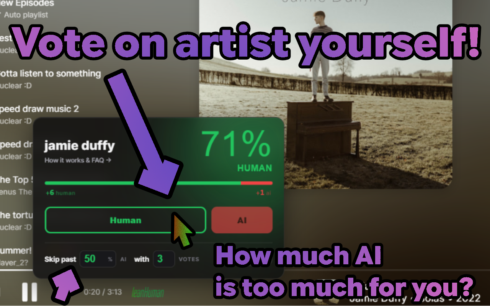

# SoundProof+
A bleeding-edge fork of SoundProof with my proposed features

> [!IMPORTANT]
> If you are here because you are an artist/fan who feels unfairly blocked, you're in luck!
> 1. check if you are included [here](https://github.com/Olafcio1/SoundProof-extension/blob/main/Platforms/YtMusic/VBlocked.js). if you are, appeal [here](https://github.com/Olafcio1/SoundProof-extension/issues).
> 2. if you're not, appeal [here](https://github.com/NuclearBlox/SoundProof-extension/wiki/Appealing-an-incorrect-rating).
> you HAVE TO provide a proof that you are making your music!

> [!IMPORTANT]
> This is an unofficial fork of the SoundProof extension. Find the original here: https://github.com/NuclearBlox/SoundProof-extension

> [!WARNING]
> This build is in beta! Things will change and may break. report back in the issues tab.

A Chrome extension that watches your music streaming platform of choice to tell you whether the song you’re listening to was made by a human or a data center.

It automatically checks the current track against SlopCall, an API built specifically for SoundProof

**Supports:** Spotify, YouTube Music, SoundCloud, Apple Music 
**Main Target:** YouTube Music

